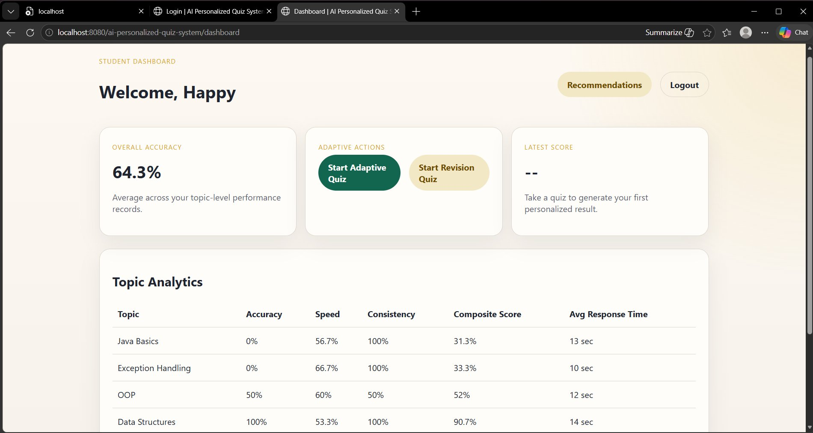
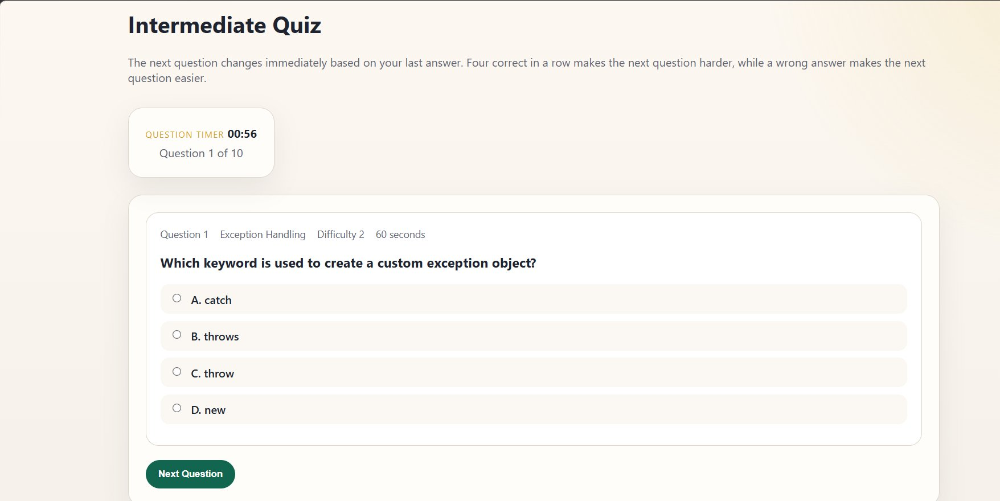

# 🎯 AI Personalized Quiz System

An intelligent Java-based adaptive quiz web application designed to enhance student learning through personalized difficulty progression, performance analysis, and dynamic quiz generation.

The system evaluates learner performance continuously and adjusts question difficulty levels accordingly, enabling students to strengthen weak concepts before progressing to advanced topics.

---

# 🚀 Key Features

## 🧠 Adaptive Quiz Engine
- Dynamically generates quizzes using a **50/30/20 difficulty distribution**
  - 50% weak topics
  - 30% medium topics
  - 20% strong topics
- Automatically adjusts quiz difficulty based on student performance.
- Promotes progressive and personalized learning.

---

## 📊 Performance Analytics Dashboard
- Tracks quiz scores and topic-wise performance.
- Displays learner analytics and progress reports.
- Helps students identify weak subject areas.

---

## 🔄 Revision Quiz System
- Automatically generates revision quizzes for incorrectly answered questions.
- Reinforces weak concepts through targeted practice.

---

## 🎯 Recommendation Engine
- Suggests learning topics and quiz levels based on historical performance data.
- Encourages continuous skill improvement.

---

## ⏱️ Real-Time Quiz Timer
- Background multithreading using:
  - `TimerThread`
  - `PerformanceAnalysisThread`
- Handles countdown timers and automatic quiz evaluation efficiently.

---

## ⚡ Exception Handling
Custom exception handling implemented using:
- `UserNotFoundException`
- `QuizNotFoundException`
- `InvalidAnswerException`

Ensures robust validation and error management throughout the application.

---

## 🏗️ MVC Architecture
The project follows a clean **MVC (Model-View-Controller)** architecture for scalability and maintainability.

### Architecture Components
- **Model Layer** → Handles business entities and database mapping
- **View Layer** → JSP-based frontend pages
- **Controller Layer** → Servlet-based request handling
- **DAO Layer** → Database interaction using JDBC
- **Service Layer** → Business logic processing

---

# 🛠️ Tech Stack

| Technology | Purpose |
|---|---|
| Java | Core application development |
| JSP & Servlets | Web application frontend/backend |
| JDBC | Database connectivity |
| MySQL | Relational database |
| Apache Tomcat | Application server |
| Maven | Dependency management & build tool |
| HTML/CSS | UI design |
| Multithreading | Background task execution |

---

# 📸 Application Screenshots

## Dashboard


## Quiz Interface


---

# 📁 Project Structure

```text
src/main/java/com/quizapp/
│
├── model/        # Entity classes
├── dao/          # Database access layer
├── service/      # Business logic layer
├── servlet/      # Controller layer
├── util/         # Utility/helper classes
└── exception/    # Custom exception handling

src/main/webapp/
│
├── *.jsp         # Frontend JSP pages
└── css/          # Styling files

database/
│
├── schema.sql
└── sample_data.sql
```

---

# 🗄️ Database Design

The application uses a relational MySQL database consisting of multiple interconnected tables for:
- User management
- Quiz generation
- Question storage
- Performance tracking
- Analytics processing

PreparedStatement-based JDBC queries are used to improve security and prevent SQL injection.

---

# 🔐 Authentication System

The system supports:
- Student login
- Admin login
- Session management
- Secure credential validation

### Demo Credentials

#### Admin
```text
admin@quizapp.com
Admin@123
```

#### Student
```text
student@quizapp.com
Student@123
```

---

# ⚙️ Prerequisites

Before running the project, ensure the following are installed:

- JDK 11+
- Maven 3.8+
- MySQL 8+
- Apache Tomcat 9+

---

# 🧩 Database Setup

## Step 1: Create Database Schema

```sql
SOURCE database/schema.sql;
```

## Step 2: Insert Sample Data

```sql
SOURCE database/sample_data.sql;
```

## Step 3: Configure Database Credentials

Update database credentials inside:

```text
src/main/resources/db.properties
```

Example:

```properties
db.username=root
db.password=your_password
```

---

# ▶️ Build & Run the Project

## Step 1: Clone Repository

```bash
git clone https://github.com/prachi-shah07/quizzheyy.git
```

---

## Step 2: Navigate to Project Directory

```bash
cd quizzheyy
```

---

## Step 3: Build Project Using Maven

```bash
mvn clean package
```

This generates:

```text
target/ai-personalized-quiz-system.war
```

---

## Step 4: Deploy WAR File

Copy the generated WAR file into your Apache Tomcat `webapps` folder.

Example:

```text
C:\Tomcat\webapps
```

---

## Step 5: Start Apache Tomcat

Go to:

```text
C:\Tomcat\bin
```

Run:

```bash
startup.bat
```

---

## Step 6: Open Application

Open browser:

```text
http://localhost:8080/ai-personalized-quiz-system/
```

---

# 📈 Adaptive Learning Workflow

1. Student logs into the system.
2. Quiz engine analyzes previous performance.
3. Questions are generated dynamically based on weak and strong topics.
4. TimerThread monitors quiz duration.
5. PerformanceAnalysisThread updates analytics after submission.
6. Recommendation engine suggests revision topics and future quizzes.

---

# 🔍 Core Concepts Implemented

- Object-Oriented Programming (OOP)
- MVC Architecture
- DAO Design Pattern
- Multithreading
- Session Management
- Exception Handling
- JDBC Connectivity
- Dynamic Quiz Generation
- Performance Analytics

---

# 🚀 Future Enhancements

- AI-generated question recommendations
- Mobile application integration
- Cloud deployment
- Gamification features
- Real-time leaderboard
- Email notifications
- React-based frontend

---

# 👩‍💻 Developer

**Prachi Shah**  
B.Tech CSE | MIT-WPU Pune

GitHub: https://github.com/prachi-shah07

---

# 📜 License

This project is developed for educational and learning purposes.